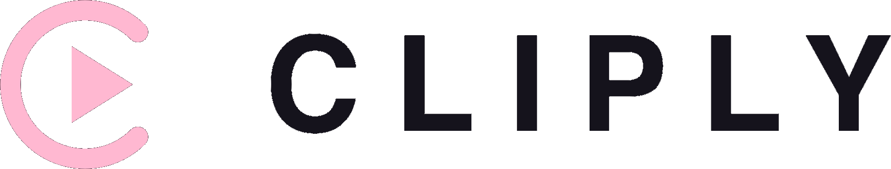

<picture>
  <source media="(prefers-color-scheme: dark)" srcset="docs/lockup.png" />
  
</picture>

# Offcut <sub>by cliply</sub>

<b>Open-source desktop clip cutter.</b><br />
Paste a link, import your analysis XML, review the clips, and export
MP4s with ffmpeg — fully offline. No account, no cloud, no telemetry.

<p>
  <a href="LICENSE"></a>
  
  
</p>

<p>
  <a href="https://github.com/cliply-video/cliply-exporter/releases/latest"><b>↓&nbsp;Download</b></a>
  &nbsp;·&nbsp;
  <a href="https://offcut.cliply.video">Website</a>
  &nbsp;·&nbsp;
  <a href="https://cliply.video">cliply.video&nbsp;↗</a>
</p>

> Want hosting, teams, sharing and live collaboration? See the full app at
> [cliply.video](https://cliply.video).

## Features

A three-step flow — **Video → XML → Clips** — with a step rail to track where you are:

- **Add a video** — a YouTube URL or 11-char video ID (downloaded with
  yt-dlp), a direct media URL (streamed over HTTP), or a local video file
  used in place. Live, cancelable download progress.
- **Import XML** (optional) — Cliply / SportsCode / Nacsport `ALL_INSTANCES`
  analysis XML; tags become colored clips read straight from the codes and
  colors in the file. BOM-aware (handles Windows UTF-16 exports).
- **Review &amp; export** — clips grouped by tag with color dots and lazily
  generated poster thumbnails, an in-app player to watch any clip from its
  timestamp, and per-clip / per-group / select-all selection.
- **Video library** — recent videos live on the landing page: resume one to
  jump back into its clips, or delete it to remove the DB rows plus the
  downloaded media and posters from disk.
- **Export** — one MP4 per clip in tidy per-tag folders, plus per-tag reels
  and a single combined reel. Stream-copy cut (fast, keyframe-aligned) or
  re-encode (frame-accurate); ffprobe inspects the source and defaults to
  re-encode automatically for non-h264 video. Cuts run in parallel across
  cores, the export is cancelable, and clip ends are clamped to the real
  media duration.
- **Auto-update** — a signed Tauri v2 updater checks for a newer release on
  launch and installs it in place (see [`docs/updater.md`](docs/updater.md)).
- **100% offline &amp; local** — everything runs on your machine, stored in a
  local SQLite database. No sign-up, no upload, no telemetry.
- **English &amp; Español** — toggle the language any time from the title bar.

## Install

Grab a build from [Releases](https://github.com/cliply-video/cliply-exporter/releases):
macOS `.dmg`, Windows `.exe` (NSIS), Linux `.AppImage` / `.deb`. Builds are
unsigned for now — on macOS, right-click → **Open** the first time to get
past Gatekeeper; on Windows, dismiss the SmartScreen prompt. Once installed,
the app keeps itself up to date via the built-in updater.

## Runtime dependencies

Three external tools, never bundled (keeps the app permissively licensed and
the download small); each is fetched once from its official source and
SHA256-verified, or a copy already on your `PATH` is used:

- **yt-dlp** (Unlicense) — auto-downloaded on first run, all platforms.
- **Deno** (MIT) — yt-dlp's JavaScript runtime, required for YouTube
  extraction; auto-downloaded, all platforms.
- **ffmpeg / ffprobe** (LGPL) — auto-downloaded on macOS (evermeet static
  build) and Windows (gyan.dev static build). On Linux, install it yourself
  (package manager) or point at it.

Override any of them explicitly with `FFMPEG_PATH`, `FFPROBE_PATH`,
`YTDLP_PATH`, `DENO_PATH`.

## Develop

Prereqs: Rust (stable), Node 20+.

```bash
npm install
npm run app        # tauri dev (Vite + Rust)
npm run app:build  # production bundle
```

Built with Tauri v2, React 19 + Vite, Rust, and SQLite.

CI (`.github/workflows/ci.yml`) runs typecheck + build and `cargo check`/`test`
on every push. Pushing a `vX.Y.Z` tag triggers `release.yml`, which builds
macOS (universal: arm64 + x64), Windows and Linux and opens a draft GitHub
release with signed updater artifacts. See [`docs/signing.md`](docs/signing.md)
for macOS signing and [`docs/updater.md`](docs/updater.md) for auto-update
setup.

## License

[Apache-2.0](LICENSE). ffmpeg, yt-dlp and Deno are downloaded at runtime as
separate binaries and are not distributed with this app; see their respective
licenses.
