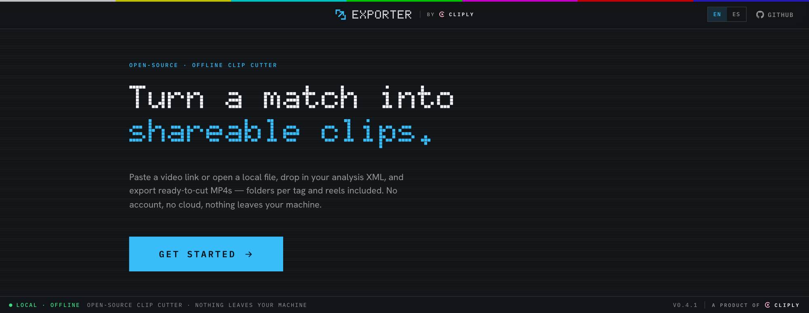
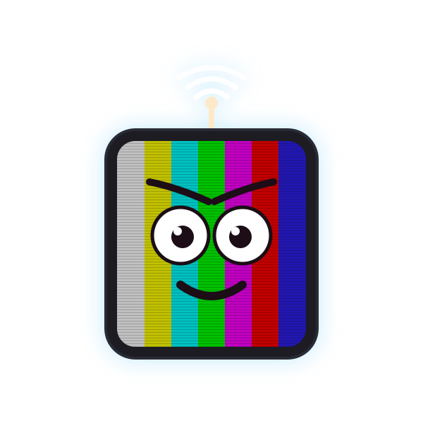

<picture>
  <source media="(prefers-color-scheme: dark)" srcset="docs/brand/offcut-lockup-dark.png" />
  
</picture>

<b>Open-source, offline desktop video toolbox.</b><br />
Download a video, cut it into clips from your analysis XML, join files, or
convert formats — all with ffmpeg, fully offline. No account, no cloud, no
telemetry.

<p>
  <a href="LICENSE"></a>
  
  
  <a href="https://github.com/cliply-video/cliply-exporter/releases/latest"></a>
</p>

<p>
  <a href="https://github.com/cliply-video/cliply-exporter/releases/latest"><b>↓&nbsp;Download</b></a>
  &nbsp;·&nbsp;
  <a href="https://offcut.cliply.video">Website</a>
  &nbsp;·&nbsp;
  <a href="https://cliply.video/?utm_source=exporter&utm_medium=readme&utm_campaign=exporter&utm_content=header">cliply.video&nbsp;↗</a>
</p>

<a href="https://offcut.cliply.video">
  
</a>

## Features



Four independent tools behind a tab rail — **Download**, **Clips**, **Join**,
**Convert**. A running job keeps going (and keeps its progress) while you use
another tool.

### Download
- A YouTube URL or 11-char video ID (yt-dlp), or a direct media URL (streamed
  over HTTP), with live, cancelable progress.
- **Save to…** moves the file where you want it; **Cut clips** and **Convert**
  hand it straight to those tools.

### Join
- Add videos — from disk, drag and drop, or your recent downloads — reorder
  them, get one file. Files that share a stream layout
  (codec, decoder config, size, audio) are appended with a stream copy —
  instant and lossless. Anything else is re-encoded to a common H.264/AAC
  shape first; silent parts get a silence track so audio stays in sync.
- The plan (fast copy vs. re-encode, and why) is shown before you run it. A
  re-encode can target a fixed frame rate (24–60) instead of following the
  first video.

### Convert
- Batch convert to MP4, MOV, MKV, WebM, or audio-only MP3 / M4A / WAV.
  Presets: **Compatible** (MP4 · H.264 · AAC), **Light** (720p), **Audio
  only**, or **Custom** — a spec sheet with every option in sight: container,
  codecs, max height, frame rate, and compression by quality level, **target
  size** (MB per file) or exact **bitrate**. Each preset reads its output spec
  back as you change it.
- **Remove audio** mutes any video output; on its own it is still a fast copy.
- Each file shows its verdict up front: **fast copy** when only the container
  changes, **audio re-encode** when just the audio needs swapping, or
  **re-encode**. Output goes next to each original or to a folder you pick;
  existing files are never overwritten. Library downloads are named by their
  title and land in Downloads rather than inside app data.

### Clips
A three-step flow — **Video → XML → Clips** — with a step rail to track where you are:

**Video**
- **Add a video** — a YouTube URL or 11-char video ID (downloaded with
  yt-dlp), a direct media URL (streamed over HTTP), or a local video file
  used in place. Live, cancelable download progress.
- **Video library** — recent videos live on the home screen: resume one to
  jump back into its clips, or delete it to remove the DB rows plus the
  downloaded media and posters from disk.

**XML**
- **Import XML** (optional) — Cliply / SportsCode / Nacsport `ALL_INSTANCES`
  analysis XML; tags become colored clips read straight from the codes and
  colors in the file. BOM-aware (handles Windows UTF-16 exports).
- **No XML?** — skip straight to saving the full video, defaulting to its
  real title as the filename.

**Clips**
- **Review & export** — clips grouped by tag with color dots and lazily
  generated poster thumbnails, an in-app player to watch any clip from its
  timestamp, and per-clip / per-group / select-all selection.
- **Export** — one MP4 per clip in tidy per-tag folders, plus per-tag reels
  and a single combined reel. Stream-copy cut (fast, keyframe-aligned) or
  re-encode (frame-accurate); ffprobe inspects the source and defaults to
  re-encode automatically for non-h264 video. Cuts run in parallel across
  cores, the export is cancelable, and clip ends are clamped to the real
  media duration.
- **Watermark** (optional) — burns the cliply mascot + "cliply.video" into the
  top-right corner, sized to the video's short side; forces a re-encode.

**Everything else**
- **Auto-update** — a signed Tauri v2 updater checks for a newer release on
  launch and installs it in place (see [`docs/updater.md`](docs/updater.md)).
- **100% offline & local** — everything runs on your machine, stored in a
  local SQLite database. No sign-up, no upload, no telemetry.
- **English & Español** — toggle the language any time from the title bar.

## Install

Grab a build from [Releases](https://github.com/cliply-video/cliply-exporter/releases):
macOS `.dmg`, Windows `.exe` (NSIS), Linux `.AppImage` / `.deb`.

- **macOS** — not notarized yet, so Gatekeeper blocks it on first launch.
  One-time fix: **System Settings → Privacy & Security → Open Anyway**, or
  ```bash
  xattr -dr com.apple.quarantine "/Applications/Offcut.app"
  ```
- **Windows** — SmartScreen warns on first run: **More info → Run anyway**.
- **Linux** — `.AppImage` (no install needed) or `.deb`.

Once installed, the app keeps itself up to date via the built-in updater.

## Runtime dependencies

Three external tools, never bundled (keeps the app permissively licensed and
the download small); each is fetched once from its official source and
SHA256-verified, or a copy already on your `PATH` is used:

- **yt-dlp** (Unlicense) — auto-downloaded on first run, all platforms.
- **Deno** (MIT) — yt-dlp's JavaScript runtime, required for YouTube
  extraction; auto-downloaded, all platforms.
- **ffmpeg / ffprobe** (LGPL) — auto-downloaded on macOS (evermeet static
  build) and Windows (gyan.dev static build). On Linux, install it yourself
  (package manager) or point at it.

Override any of them explicitly with `FFMPEG_PATH`, `FFPROBE_PATH`,
`YTDLP_PATH`, `DENO_PATH`.

## Develop

Prereqs: Rust (stable), Node 20+.

```bash
npm install
npm run app        # tauri dev (Vite + Rust)
npm run app:build  # production bundle
```

Built with Tauri v2, React 19 + Vite, Rust, and SQLite.

CI (`.github/workflows/ci.yml`) runs typecheck + build, and `cargo fmt --check`,
`clippy` and `cargo test` — the join/convert tests run against a real ffmpeg —
on every push. Pushing a `vX.Y.Z` tag triggers `release.yml`, which builds
macOS (universal: arm64 + x64), Windows and Linux and opens a draft GitHub
release with signed updater artifacts. See [`docs/signing.md`](docs/signing.md)
for macOS signing and [`docs/updater.md`](docs/updater.md) for auto-update
setup.

## Want more?

Offcut cuts clips locally, on your machine. For hosting, teams, live sharing
and collaboration, see the full app at
[cliply.video](https://cliply.video/?utm_source=exporter&utm_medium=readme&utm_campaign=exporter&utm_content=cta).

## License

[Apache-2.0](LICENSE). ffmpeg, yt-dlp and Deno are downloaded at runtime as
separate binaries and are not distributed with this app; see their respective
licenses.

<br />


<p align="center">
  <a href="https://cliply.video/?utm_source=exporter&utm_medium=readme&utm_campaign=exporter&utm_content=footer">
    <picture>
      <source media="(prefers-color-scheme: dark)" srcset="docs/brand/cliply-sign-dark.png" />
      
    </picture>
  </a>
</p>
